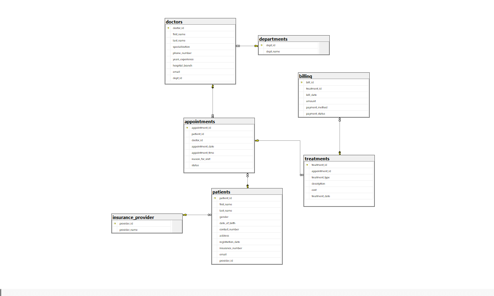

# Healthcare Operations and Revenue Analysis (SQL) 🏥

## 📌 Executive Summary
This project demonstrates the transition of a flat-file healthcare dataset into a highly optimized, normalized relational database. I implemented **3rd Normal Form (3NF)** architecture to ensure data integrity and wrote advanced SQL queries to identify revenue leakage and patient behavior patterns.

## 🛠️ Tech Stack & Skills
* **Database:** Microsoft SQL Server (T-SQL)
* **Concepts:** Database Normalization (1NF-3NF), Referential Integrity, CTEs (Common Table Expressions), Data Auditing, Schema Optimization.
* **Business Intelligence:** Operational Efficiency, Financial Modeling, Retention Metrics.

## 📐 Database Architecture (ERD)
I transformed the initial flat data by extracting redundant insurance and departmental information into lookup tables, significantly reducing data redundancy and storage overhead.

**Key Architectural Decisions:**
* **Departmental Mapping:** While the raw dataset only contained Doctor Specializations, I mapped these to functional Hospital Departments to provide a higher-level executive summary of performance.
* **Refined Grain:** I normalized the schema to remove redundancy in the billing table, ensuring that every invoice is tied directly to a verified medical treatment record via a 1:1 relationship.

---

## 🔍 Key Business Insights

### 1. Operational Efficiency (Dept. Performance)
Identified which departments handle the highest patient volume compared to their average billing. This helps hospital management balance staffing levels against revenue generation.

### 2. Patient Loyalty (Retention Rate)
Created a "Repeat vs. One-Time" visitor metric using CTEs. 
* **Insight:** By isolating individual patient behavior, management can identify which specialists drive the highest long-term patient loyalty, as high retention rates often correlate with physician trust and treatment success in healthcare.

### 3. Financial Trends (Insurance Revenue)
Analyzed month-over-month revenue trends broken down by insurance provider. 
* **Accuracy Note:** This analysis filters strictly for **completed** appointments with **paid** statuses to provide a true "realized revenue" report rather than just "potential" billing.

### 4. Revenue Leakage (The "No-Show" Cost)
**Most Impactful Metric:** Calculated the No-Show rate per department and converted those missed appointments into an amount of **Estimated Lost Revenue**. 
* **Actionable Insight:** Provides a data-driven justification for implementing automated SMS/Email appointment reminders in high-leakage departments.

---

## 🚀 Technical Highlights & Challenges
* **Data Fidelity:** Resolved a common ETL issue where phone numbers were imported as `FLOAT`. I utilized a `BIGINT` middle-man conversion before casting to `VARCHAR` to preserve data integrity (avoiding resulting in scientific notation).
* **Defensive Coding:** Implemented `NULLIF` in all division logic to prevent "Divide by Zero" errors, ensuring scripts are production-ready for datasets of any size.
* **Integrity Audits:** Conducted a "Pre-Deletion Audit" using `sys.foreign_keys` to verify system linkages before dropping redundant columns.

## 📁 Project Structure
* **`Hospital_Management_Raw_Dataset`**: Directory containing the individual source CSV tables (Patients, Doctors, Appointments, Billing, and Treatments) used to build the relational database. Source from [Kaggle](https://www.kaggle.com/datasets/kanakbaghel/hospital-management-dataset).
* **`Schema_Setup.sql`**: Full DDL/DML script for database creation, 3NF normalization, and constraint implementation.
* **`Analysis_Queries.sql`**: The 4 core business intelligence queries using advanced T-SQL.
* **`ERD_Diagram.png`**: Visual representation of the relational schema. 

---
**Contact**
* **Name:** David Aimienwanwu
* **LinkedIn:** [My Linkedin Profile](www.linkedin.com/in/davidaimienwanwu)
